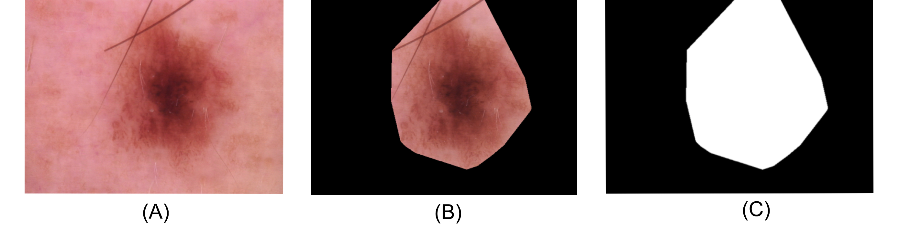

HAM10000
*******************

The HAM10000 dataset provided is a collection of 10,000 images of skin lesions with one 7 potential classifications: Actinic Keratoses and Intraepithelial Carcionma, Basal cell carcinoma, Benign keratosis, Dermatofibroma, Melanocytic nevi, Melanoma, or Vascular skin lesions.
Below is an image of the original image and the masking process used to compute persistence diagrams.

Due to size, this dataset is not available as part of the package, but is available for download in either the `raw format <https://persistencedata.s3.us-east-2.amazonaws.com/ham10000_images.tar>`_ or as `precomputed persistence diagrams <https://persistencedata.s3.us-east-2.amazonaws.com/persistence.zip>`_.

Please refer to our paper for additional details and citations.

